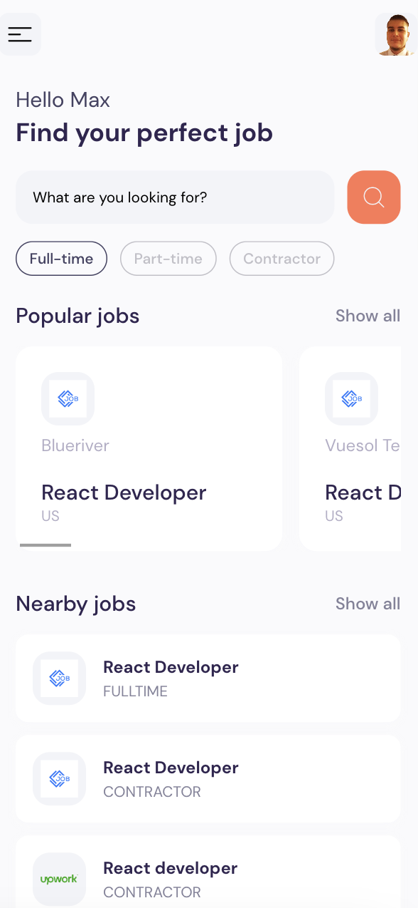
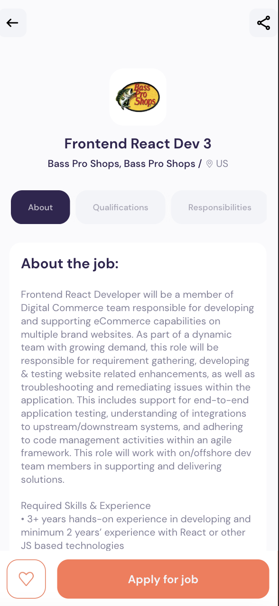
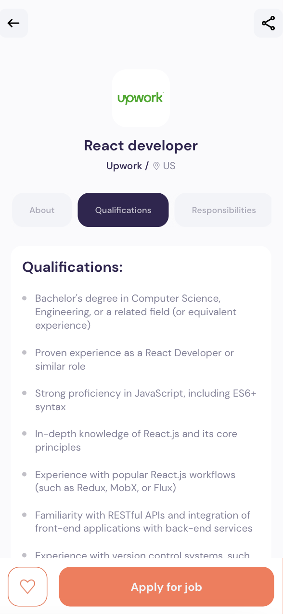

## `React-Native` Job Search mobile app project
under node v18.2.0

### 🎯 Goals:
- Build a fully functional home page
- Fetch Popular & Nearby jobs from an API
- Search for full-time, part-time jobs and contractor jobs
- Navigate to the job details page to see it's qualifications
- Implement Loading indicators and a full pagination

### 🚀 Setup:
Build project:
```sh
npx create-expo-app -e with-router
```
Extra dependencies:
```sh
npm i expo-font axios react-native-dotenv
```

### 🔥 Expo Cli:
For helping the development process, I downloaded the `Expo Go` mobile app on Google Store & installed it's CLI:
```sh
npm i -g expo-cli 
```
To run the Metro Bundler on mobile:
```sh
expo-cli start --tunnel
```
Expo Router has the best routing concepts to Native IOS and Android applications:
[documentation](https://expo.github.io/router)

### 🔑 API:
[JSearch](https://rapidapi.com/letscrape-6bRBa3QguO5/api/jsearch/) endpoints

### 💎 Component Structure & UI:




### ✅ Deployment:
Publish to expo:
```sh
expo publish
```
Open deployed app:
[SCAN QR CODE]

